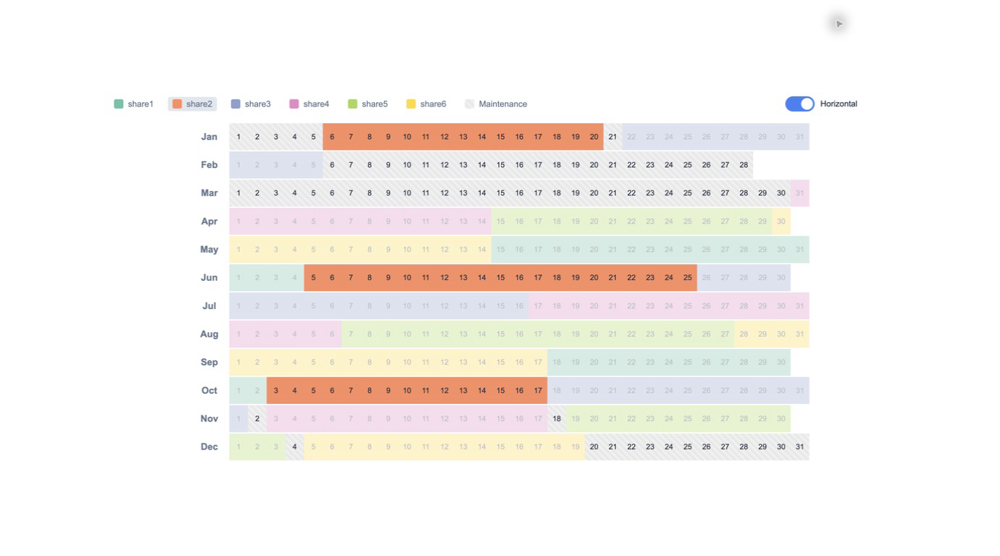

# Timeshare Calendar Visualization

A React-based visualization tool for managing and displaying timeshare periods of a vacation property. The application provides an interactive calendar view that helps track and visualize usage periods for different shares throughout the year.



*Actual production build with the horizontal layout enabled and `share2` selected. The three orange allocation periods remain prominent while the other shares are dimmed.*

## Features

- **Interactive Calendar Grid**: Visual representation of timeshare periods across the year
- **Multiple Share Support**: Handles multiple shares with different usage periods
- **Period Highlighting**: Click on share labels to highlight specific share periods
- **Flexible Layout**: Toggle between horizontal and vertical calendar orientations
- **Customizable Periods**: Easy configuration of share periods through a simple data file

## Usage

The application displays usage periods for 6 shares, with each share having 3 designated periods throughout the year. Share periods can be customized by modifying the `src/data/shares.ts` file using the following format:

```typescript
{
  share1: [
    ["DD.MM", "DD.MM"],  // First period
    ["DD.MM", "DD.MM"],  // Second period
    ["DD.MM", "DD.MM"]   // Third period
  ],
  // ... additional shares
}
```

### Interaction

- Click on share labels in the legend to highlight specific share periods
- Use Tab and Enter or Space to operate the share filters from a keyboard
- Use the orientation switch to toggle between horizontal and vertical calendar views

## Development

This project is built with:
- React
- TypeScript
- Vite

To run the project locally:

1. Clone the repository
2. Install dependencies: `npm install`
3. Start development server: `npm run dev`
